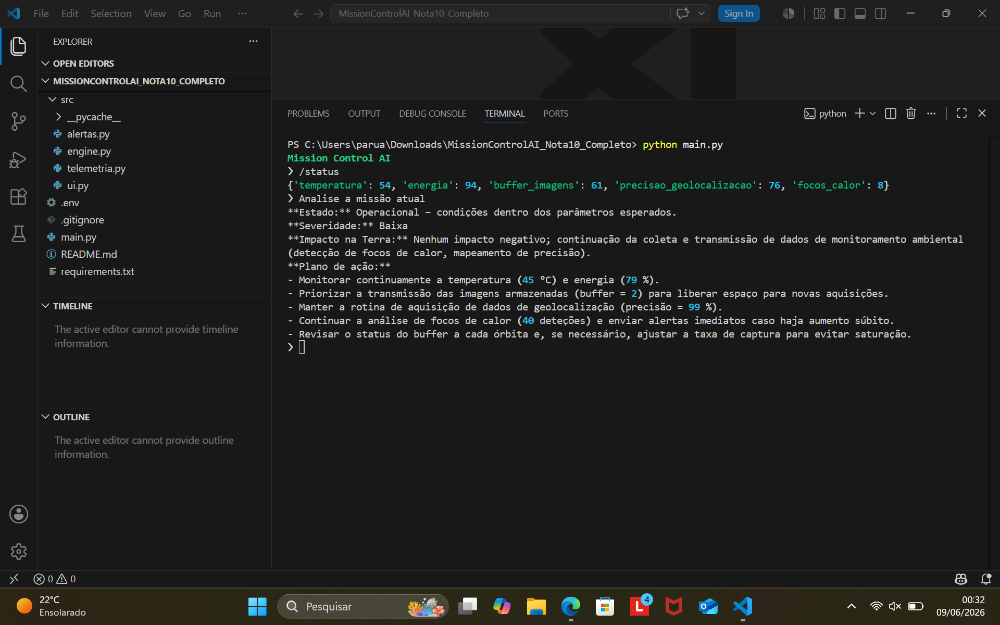
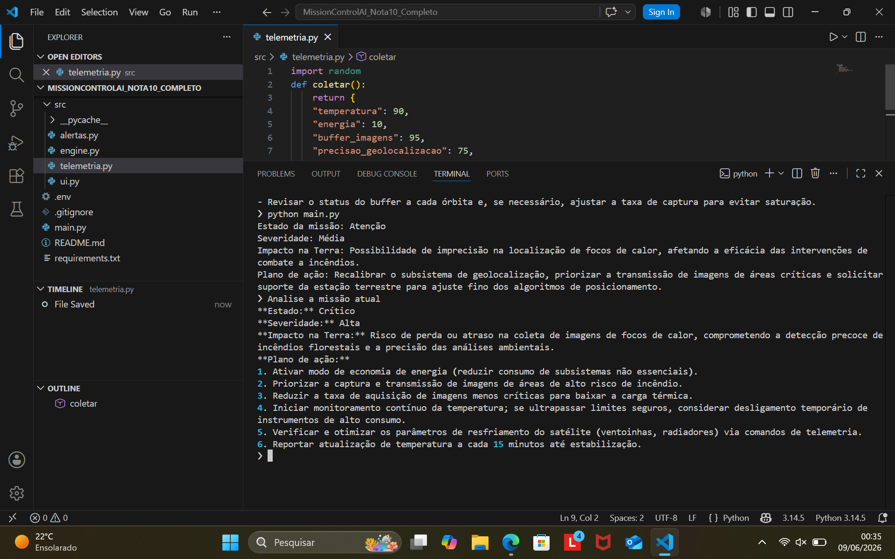

#  Mission Control AI

## pedro souza castro 569311

## O que o projeto faz
Monitora um satélite ambiental (EnviroSat), detecta anomalias por regras Python e usa IA para explicar riscos, impactos terrestres e ações recomendadas.

## Persona
Analista de operações espaciais especializado em monitoramento ambiental.

## Tecnologias
- Python 3.10+
- Ollama Cloud (gpt-oss:120b)
- python-dotenv
- rich

## Como executar
1. pip install -r requirements.txt
2. Criar .env com OLLAMA_API_KEY
3. python main.py

## Cenários de teste
1. Operação normal
2. Temperatura crítica
3. Energia crítica
4. Perda de precisão geográfica

## Limitações
Dados simulados e sem integração com sensores reais.

## Proposta de valor
Problema: detecção tardia de incêndios e desmatamento.

Quem paga: órgãos ambientais, governos e empresas de monitoramento.

Impacto: milhares de hectares monitorados continuamente.

Modelo: Dados-como-serviço (DaaS).
## Demonstração

### Sistema em execução

### Análise da missão

